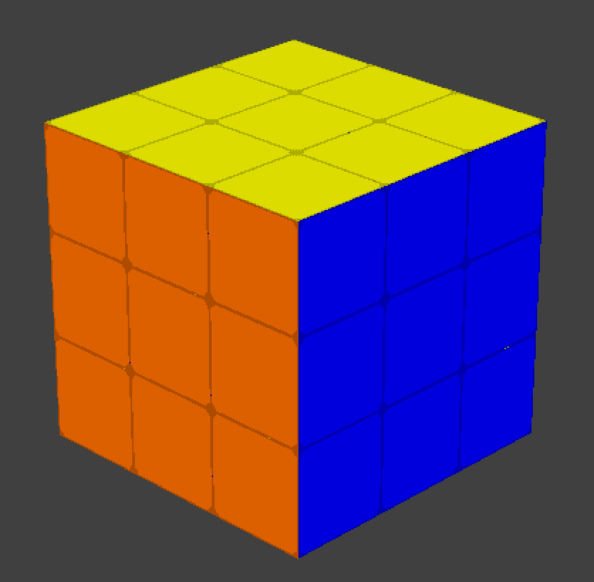
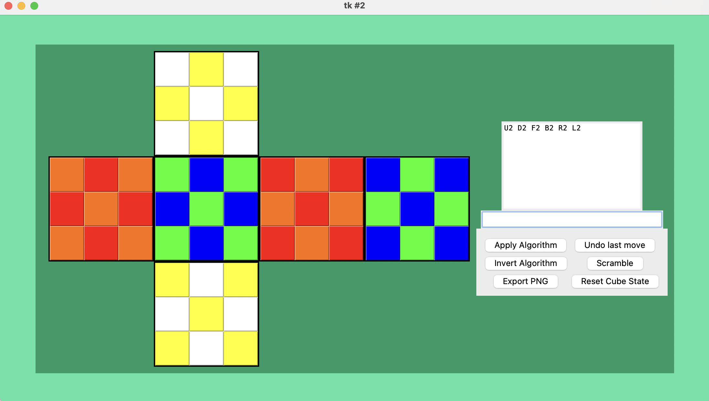
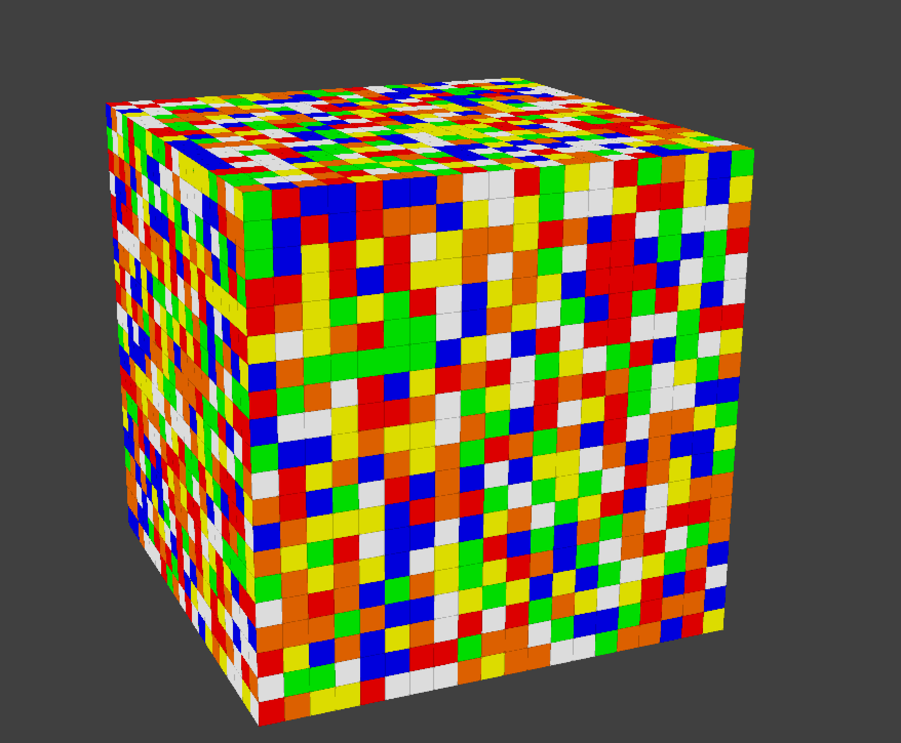
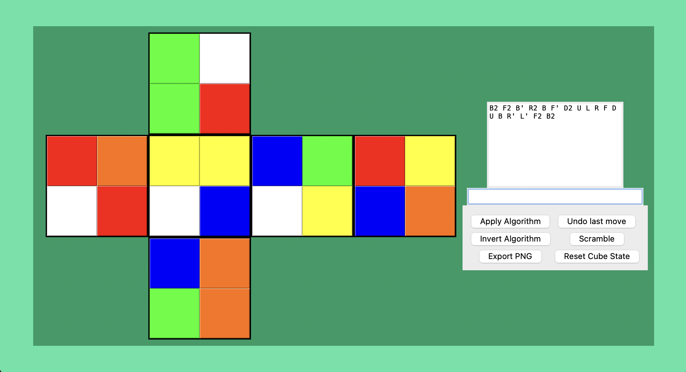

# Cube Playground (WIP)
This is a Rubik's cube sandbox explorer built in Python. I wrote the code in Spanish just to practice the language but the UI will be avaliable in English. Later I may take the time to translate all the code to English.

## Current features:
- Rubik's cube generation of any size NxN, (2x2, 3x3, 100x100, as much as your CPU can handle)
- Algorithm execution (sequences of moves) via manual input
- Automatic scrambling
- Production of PNG images of any cube state

A barebones 3D visualization is currently functional, I am working on integrating the other features into the 3D window. For now the primary functionality is operational in the 2D visualizer window.

## Requirements:
- Python 3.12
- [NumPy](https://pypi.org/project/numpy/)  (matrix operaitons)
- [Pillow](https://pypi.org/project/pillow/) (image generation)
- [Ursina](https://www.ursinaengine.org/) (3d graphics)

You can install these libraries through pip by running:
```
pip install -r src/requirements.txt
```
Once you have all the requirements installed, you can run the program by running:
```
python src/main.py
```

## Screenshots





